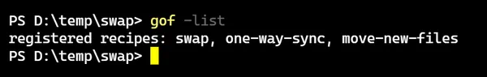
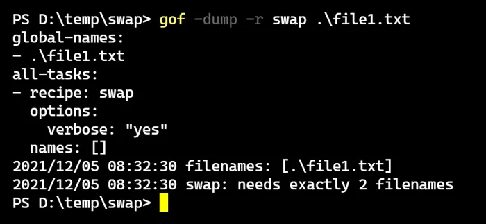
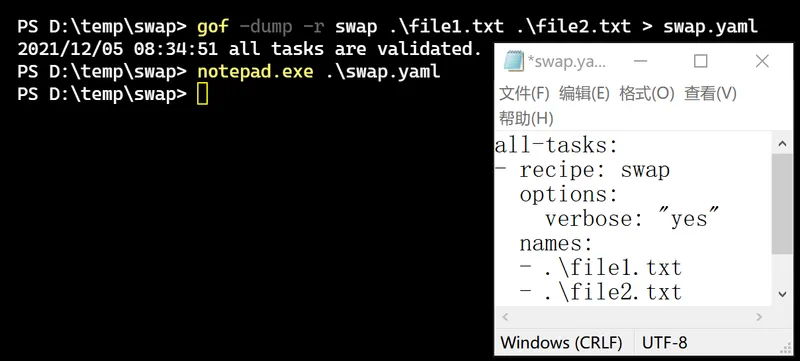
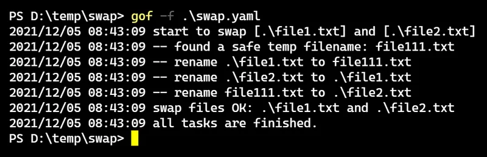
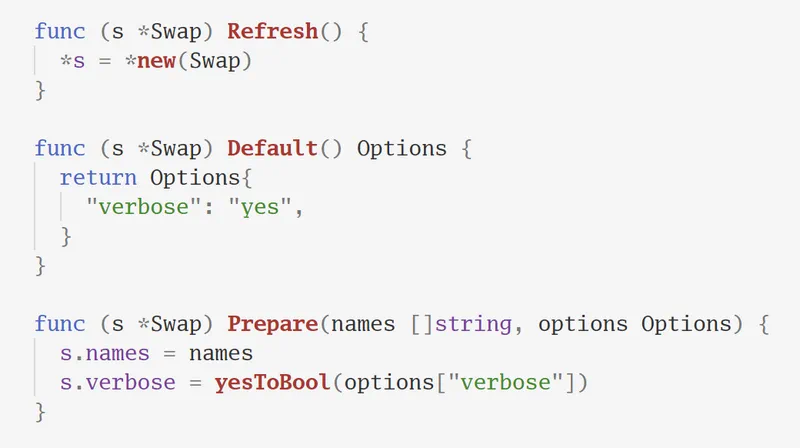

# gof: 一个可扩展的文件处理器（带截图说明）

gof 是一个纯命令行程序，可以用 Go 语言来写扩展，专门用于处理文件/文件夹。


## 安装方法

配置好 Go 语言环境后，执行以下命令：

```
$ go install github.com/ahui2016/gof@v0.2.0
```

即可完成安装，后续如有新版，只需要修改最后的版本号再执行一次上述命令即可升级。


## 使用方法

用 `-list` 参数可以看看已经安装了哪些插件：



可以看到，目前只有三个插件，但 gof 主要是一个框架，用来方便用户自己写插件的。因为处理文件的需求千差万别，每个人的常用需求都不一样，自带的少量插件主要是我自己要用，并且可以当作例子供参考。


用 `-help` 参数可以查看各个插件的说明：


在实际执行之前，可以用 `-dump` 命令来查看任务计划（只显示信息，不会实际操作文件）：



通过任务计划可确认文件名对不对、参数对不对，并且还会对任务进行初步检查，在上面的截图中可以看到错误提示：需要两个文件名。


检查无误后，去掉 `-dump` 即可实际执行命令。另外，`-dump` 还可以用来生成 YAML 文件：




生成后，以后如果需要重复执行相同的任务，就很方便了，只要用 `-f` 指定 YAML 文件即可：




在 YAML 文件里，可以组合使用多个任务，会按顺序依次执行：

```yaml
# 可以添加多个任务（可以是不同的 recipe），将会按顺序依次执行。
all-tasks:

# 第一个任务
- recipe: swap   
  options:       
    verbose: yes 
  names:         
  - file1.txt
  - file2.txt

# 第二个任务
- recipe: swap
  options:
    verbose: no  # 第二个任务不显示详细过程
  names:
  - file2.txt
  - file3.txt

# 假设有三个文件
#    file1.txt 的内容是 111
#    file2.txt 的内容是 222
#    file3.txt 的内容是 333

# 用 gof 指定内容如上所示的 YAML 文件运行后，应该变成
#    file1.txt 的内容是 222
#    file2.txt 的内容是 333
#    file3.txt 的内容是 111
```


## 制作插件

以上所示大多数功能，都是 gof 自带的，当你有特殊的需求时可以自行制作插件，非常简单，只需要实现一个接口即可：


其中，`Name()` 只是返回一个字符串（比如 "swap"）。

`Help()` 也是返回一个字符串，通常只是一个带注释的 YAML 文件的内容即可，也很简单。（从上文的使用方法中可以看到，YAML 文件可以一个命令轻松生成。）

`Refresh()` 用来更新自己，`Default()` 返回一个默认参数，`Prepare()` 初始化内部变量，这几个方法都是极容易实现的，下面就是一个真实例子：



`Validate()` 用来检查用户输入的参数是否正确，比如文件名的数量对不对，还可以在这里测试文件是否真实存在，但在这里不可修改文件，这个命令对应 `-dupm` 参数，是用来给用户在实际执行之前做初步检查的，因此，Validate 里面的一切操作必须是安全的。

其中，用户可通过命令行输入参数，也可以通过指定 YAML 文件来输入参数，对命令行和 YAML 文件的处理都是 gof 自带的功能，插件制作者只需要专注于业务逻辑即可。

`Exec()` 才是实际处理文件的代码，有了上面的初始化和初步检查之后，写实际代码也会变得轻松，因为比如文件数量对不对、文件是否存在等问题都已经在前面检查过了。


## 为什么不用专业的 GUI 软件？

就我自己的实际使用情况，比如我需要单向同步文件夹，我本来使用 Total Commander, 在制作好一个任务之后，后续每当我需要再同步一次时的操作步骤是：

1. 点击 "同步" 按钮
2. 点击收藏夹
3. 再点击一次选择任务
4. 点击对比
5. 点击执行同步
6. 点击不询问覆盖文件
7. 最后点击确定才真的执行

而使用 gof，在制作好一个任务后，后续每次的操作步骤是：

1. 进入源头文件的文件夹
2. 执行命令 `gof -f gof.yaml` 

就可以了，显然比 GUI 的多次点击更方便。而且，每个 GUI 专业软件的功能都有限，不同的任务可能需要不同的软件，有些需求（比如我需要经常对调两个文件的文件名）也不好找软件。


## 不喜欢 Go？

当然，Go 的优缺点都比较明显，有人喜欢它的简单，有人嫌弃它用起来太原生态。gof 本身功能不多，代码量很少，参考着 Go 代码用其他语言实现一遍最多只要半天时间，因此有类似需求但又不喜欢 Go 的话完全可以用自己喜欢的语言实现一个类似的程序。

我自己实际使用感受，命令行与 YAML 的组合既容易编写程序，也能更直观地修改参数（比如输入文件名时特殊字符不需要转义），有一个 YAML 文件也能方便多次重复执行相同任务，还可以把不同的任务组合在同一个 YAML 文件里按顺序执行，是一种很不错的方式。


## 源码仓库

https://github.com/ahui2016/gof
